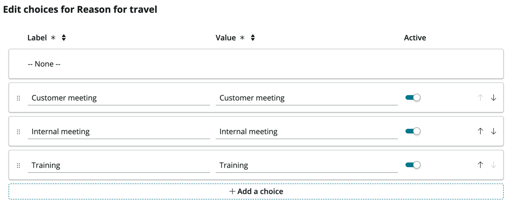
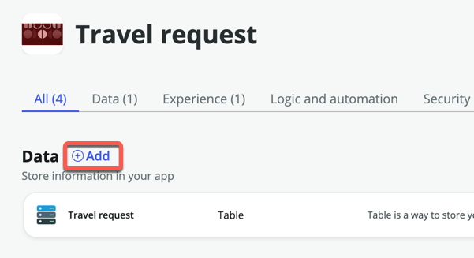
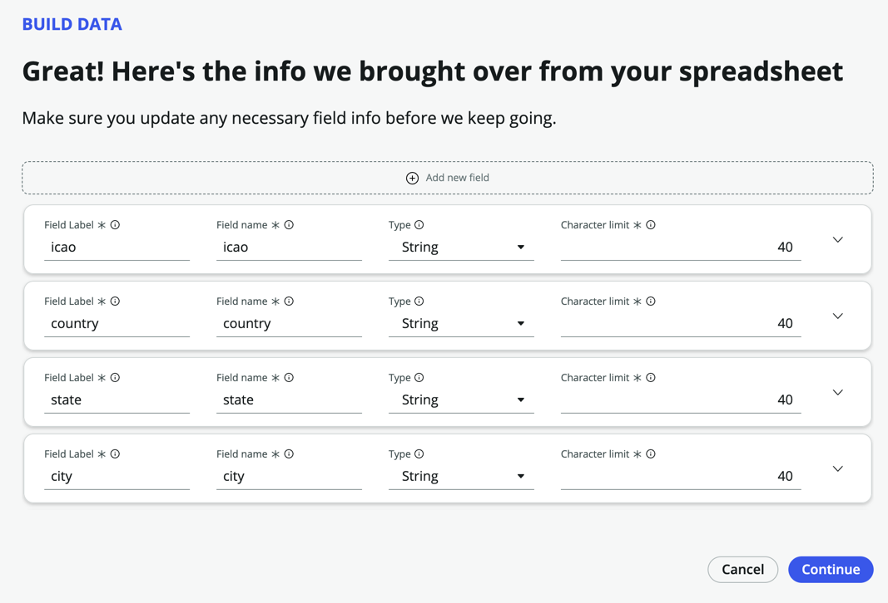

# Exercise 1: Creating tables for our travel request application

**Duration: 20 minutes**

## Introduction

In the first section, we will create two tables. Our first table will be used to capture the Travel Requests coming in from employees, and our second table will be used to store all the major airports and cities that can be traveled to. We will assume that all Travel Requests will only be for air travel.

## Let's start

1. Click **All**, then search and click **App Engine Studio**

    

1. Click **Create app** on the top right of the screen

    

1. On the Create App page, name the app "Travel request", and for description, enter "Track travel requests from employees."

    

1. Click **Continue**

1. Leave the default roles - *admin* and *user*, and click **Continue**

1. Click **Go to app dashboard**

    > What you've just done is create a scoped application. Scope uniquely identifies every application file, why is this important?
    >- Scope protects an application, its files, and its data from conflicts with other applications.
    >- Scope determines which parts of an application are available for use by other applications in ServiceNow.
    >- Scope allows developers to configure which parts of their application can be acted on by other applications.
    >- Scope prevents work done in the main ServiceNow browser window (not in Studio) from becoming part of an application's files.
    >- Without Scope, it will be very difficult to govern new applications!

## Create a Travel Request table

We will now create a table to capture the travel requests.

1. Under **Data**, click **Add**

    

1. On the *Add Data* page, click **Create a blank table**

1. Click **Continue**

    

1. On the next page, select **Create from an extensible table**

1. Click **Continue**

    

1. On the next page, click **Table**, and select **Task** under *Recommended Tables*

    

    >The task table is one of the core tables provided on the platform. Any table that extends task can take advantage of task-specific functionality such as SLAs and Approvals. This speeds up the overall process and ease of building logic and functionality.

1. Click **Continue**

1. For Table label, enter **Travel request**. Table name should be auto-populated.

1. Check **Auto number**

1. For Prefix, enter **TRV**

    

1. Click **Continue**

1. Allow all access for *admin* and **Create** and **Read** access for *user*

    

1. Click **Continue**

1. Click **Edit table**

1. If presented with the **Welcome to Table builder** pop-up, read through the steps, then close it

1. You should now be on the *Table Builder* interface, in the *Spreadsheet* view

    > Instead of adding fields individually via table builder, we will add fields directly onto the form view instead. But note that there are several ways to add fields to a table.

1. Click on the **Forms** pill

    

1. The current form layout is inherited from the **task** table, we will only keep the fields relevant to us

1. Remove the following fields from the form:
    1. Priority
    1. Assigned to
    1. Configuration item
    1. Parent

    

1. The form should look like this

    

1. On the left panel, click **Add a field in the table**

    

1. On the pop-up modal, enter **Departure date** under **Column label**, the **Column name** should be auto-populated

1. Change **Type** to **Date**

    

1. Click **Add**

1. Click **Add another one**

1. Enter **Return date** under **Column label**, the **Column name** should be auto-populated

1. Change **Type** to **Date**

    

1. Click **Add**

1. Click **Add another one**

1. Repeat the steps above for the following 2 fields:

    Column label | Type
    -------------- | --------------
    Number of days | Integer
    Reason for travel | Choice

1. The panel on the left should show 4 new fields with a purple highlight

1. Drag and drop those 4 fields onto the form

    

    > Tip: You will need to ensure that you see a grey outline box with a plus icon before releasing the field
    

1. Search and add two more standard fields onto the form: **Opened by, Approval** (These come standard with the **Task** table)

1. Click **Save** on the top right of the form

1. Within you form, locate and click **Reason for travel**

1. The right-side panel will update for the configuration of this field. Expand **Choices**, then click **Edit (1)**

    

1. On the **Edit choices for Reason for travel** screen, click **+ Add a choice**

1. Under **Label**, enter Customer meeting, the **Value** field should auto-populate

1. Add another two Labels: **Internal meeting** and **Training**

    

1. On the bottom right, click **Apply**

1. Click **Number of days**

1. On the right-side panel, expand **Formula** and click **+Add**

    

1. In the pop-up **Formula** box, you are able to enter Excel based formulas. Here, we would like to calculate the number of days traveled

1. Enter **TIME**, the it should automatically pickup the operator for **TIMEDIFF**, press Enter

    

1. The inputs are shown in the formula example below, we need to provide two different date values

1. Within the brackets, first type *return**, then select your custom field **return_date**

1. Key in a **comma**

    

1. Finish off the formula by entering and selecting **departure_date**

    

1. Click **Submit**

1. Click **Save**

    At this point, we could also capture the Origin and Destination via a String field so that the users can enter free text, but for more consistency, let's create an **Airports** table so that users can select these locations (like how you would select on any airline reservation website)

## Create an Airport table

1. Click the **App Home** tab to return to the main view

    

1. Under **Data**, click **Add**

    

1. Click **Import a spreadsheet**

    

1. Click **Continue**

1. Download this file: [airports.xlsx](https://github.com/shaoservicenow/travelrequest/raw/main/docs/downloads/airports.xlsx "download")

1. Upload the downloaded file to the upload box. You should see the following screen once the upload is successful

1. Ensure that **Enter a row number for the table header** is set to **1**

1. Check the **Import spreadsheet data** box

    

1. Click **Continue**

1. On the following page, click **Create new table**

    

1. Click **Continue**

1. You should land on the page that says: "Great! Here's the info we brought over from your spreadsheet"

    

1. Scroll through the list to see all the fields that will be created. Notice that you can change the data **Type** if necessary, but we can leave everything as String fields for now

1. Click **Continue**

1. Under **Table label**, enter **Airport**. **Table name** will be automatically populate
    
1. Click **Continue**

    

1. In the roles page, check **All** for *admin*, and only **Read** for *user*

    

1. Click **Continue**

1. Click **Edit table**

1. You should see the imported data in the Table spreadsheet view

    

    > In case you were wondering, the Lat and Lon fields are deliberately left empty. In the optional bonus exercise, we will use an API to get these values, but has no impact on our exercises.

1. Click more next to the **Data** pill, and change the **Data views** to **Fields**

    

1. Toggle **Display** to true for the **Name** field

    

1. Click **Save**

Great, you now have a table to store the list of Airports!

## Completing the Travel request table

1. If the **Travel request** tab is still open, click to navigate to it

    

1. If not, return to **App Home** and open the **Travel request** table, ensure you are in the **Form** view

1. Click **+ Add a field in the table**, and add the following fields:

    Column label | Type
    -------------- | --------------
    Travel from | Reference (Airport)
    Travel to | Reference (Airport) 

    

1. Drag and drop your two newly created custom fields onto the form

    

1. Click **Save**

    > For simplicity, we are not adding additional fields like Daily estimated expenses, etc. You can always choose to add those fields if you want to.

Congratulations, you have completed Exercise 1 and now have a complete way to store the Travel requests from your employees.

 

[Previous screen](https://shaoservicenow.github.io/travelrequest/){: .btn .mr-4 }
[Next exercise](https://shaoservicenow.github.io/travelrequest/docs/Exercise%202.html){: .btn .btn-purple }
