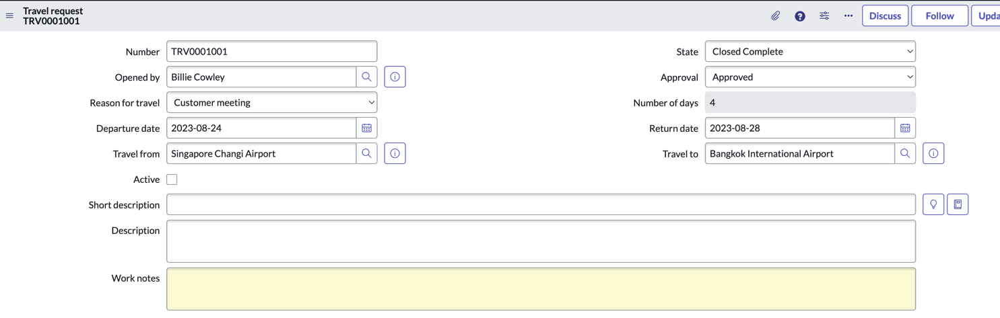

# Exercise 4: Putting it all together - Testing our application

Congratulations on making it so far! We have one last thing to do, which is to test our application. We will first directly grant a Travel request user role to one of our employees for the test.

1. Head back into the main ServiceNow interface

1. On the global search, enter **billie.cowley** and click **View results**

    

1. Click **Billie Cowley**

    

1. On Billie's user record, click the **Roles** tab below, then click **Edit**

    

    >Also notice on the screenshot above that Billie's manager is Krystle Stika. You won't be able to see this on your screen, but note that this has been preconfigured for you.

1. Under **Collection**, search **x_snc_travel**, you should see the two roles you created for your custom application.

1. Grant the **user** role to Billie by moving it into the **Roles List**
    
    

1. Click **Save**

1. Click on the profile picture on the top right, and click **Impersonate user**

    

1. Search and select **Billie Cowley**

1. Click **Impersonate user**

    

1. Close the pop-up screen

1. Copy the current URL of the page, and open a new Browser tab

1. Paste the URL, and replace everything after **service-now.com** with **/sp**

    > e.g. **if the copied URL is**: https://sad-oct-123-001.lab.service-now.com/now/nav/ui/classic/params/target/ui_page.do%3Fsys_id%3De7766625074130102b8affa08c1ed037   
    **change it to:**
    https://sad-oct-123-001.lab.service-now.com/sp 

1. The Service Portal page should now open

1. Under **How can we help?**, search for **Travel request**

    

1. Click the **Search icon**

1. The top result should return the form we had created in Exercise 2

    

1. Click **Raise a travel request**

1. Confirm that the form appears as expected, then fill in all the fields

    

1. Click **Submit**

1. The next screen can be used to track the status of the request and add attachments

    

1. Go back to the ServiceNow main interface, and **End impersonation**
    
    

1. Under **All**, search and select **My Approvals**

    

1. Remove the filer by clicking **All**

    

1. Filter by the latest created approval date by clicking **Created**

1. Click on the **Requested** record for **Krystle Stika** as the **Approver**

    

1. Click **Approve**

    

1. You will be brought back to the list view

1. Click on the Approved record for your Travel request, if you followed all the steps so far, this should be the first record created: TRVREQ0001001

    

1. On the record, notice that the **State** was automatically changed to **Closed Complete**, as per our approval flow that was designed
    
    

# Congratulations, you did it!

You've successfully built a simple application to track requests for employees to raise travel requests!

There are obviously so much more you can do with the application to make it even better, some ideas:

1. Integrate with APIs to get a list of flights on specific travel dates so you get as accurate a travel estimate as possible

1. Run all requests and approvals via Email / Microsoft Teams / Slack / Virtual Agent etc.

1. Build dashboards to track requests

1. Build a travel workspace with playbooks that can monitor requests and also have direct communication with the requestors

You get the idea, the list is endless. You are only limited by your imagination on making the experience seamless for every one involved. This is only the beginning!

ServiceNow makes the world of work, work better for people!

